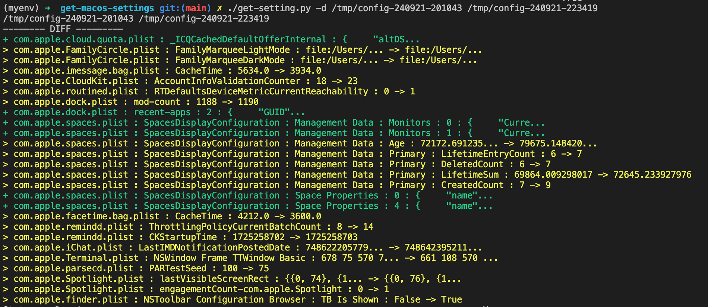

# get-macos-settings
Tool to get domains and keys about previous modifications. 


sources : 
- https://github.com/yannbertrand/macos-defaults
- https://github.com/kevinSuttle/macOS-Defaults/blob/master/REFERENCE.md

## Usages

```
get-setting.py [-h] [-r] [-a] [-s] [-v] [-d old-config-directory new-config-directory]

Does a thing to some stuff.

optional arguments:
  -h, --help            show this help message and exit
  -r, --record          to record a modification in files settings
  -a, --allDomains      to record a modification in files settings from all domains
  -s, --snapshot        to take a snapshot of a current configuration
  -v, --verbose         to enable a verbose mode
  -d old-config-directory new-config-directory, --diff old-config-directory new-config-directory
                        to compare 2 configurations (they mys be already saved in directory)
```

## Examples 



### To scan a configuration 
>The configuration will be seved in `/tmp/config-<timestamp>`.

- For common domains : `./get-setting.py -s`
>The common domains are ['NSGlobalDomain', 'com.apple.systempreferences', 'com.apple.finder', 'com.apple.desktopservices', 'com.apple.Safari', 'com.apple.AppleMultitouchTrackpad', 'com.apple.dock', 'com.apple.universalaccess']

- For all domains : `./get-setting.py -sa`

### To compare 2 configurations :
`./get-setting.py -d /tmp/config-220924-211341 /tmp/config-220924-212359`

## Use cases

This tool could be used to identify precisely what the differences between two macos configurations (on the same hardware), after editing configuration for example, and then, apply this configuration with `defaults` or `PlistBuddy` commands, or automatically with [HardeningPuppy](https://github.com/ataumo/macos_hardening) script.

## Env

It's recommended to use a dedicated env to run this this python script.
- Create env : `python3.12 -m venv myenv`
- Run it : `source myenv/bin/activate`

pbPlist package has been modified to fix error :
file : myenv/lib/python3.12/site-packages/pbPlist/pbRoot.py
+ from collections.abc import MutableMapping

- class pbRoot(collections.MutableMapping):
+ class pbRoot(MutableMapping):

## Contribution 

See [TODO.md](output-example.png) file to show what could be done/added on this project.